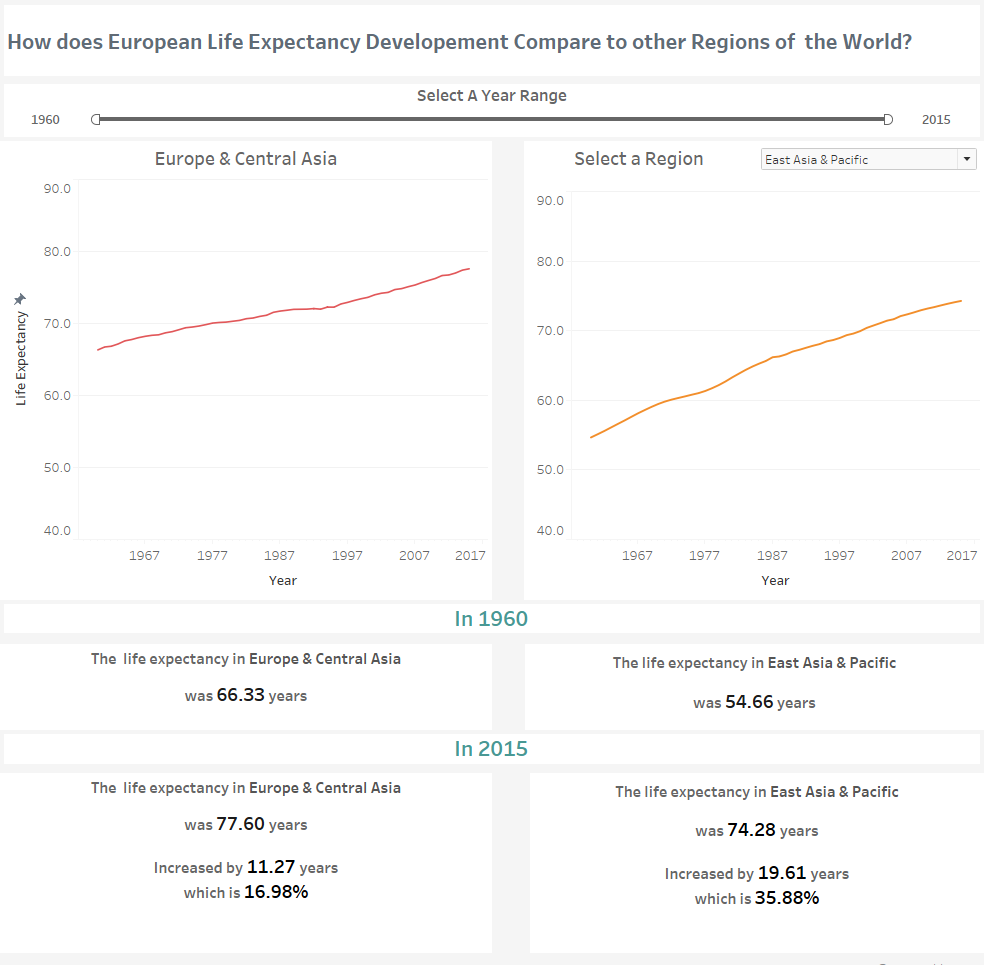
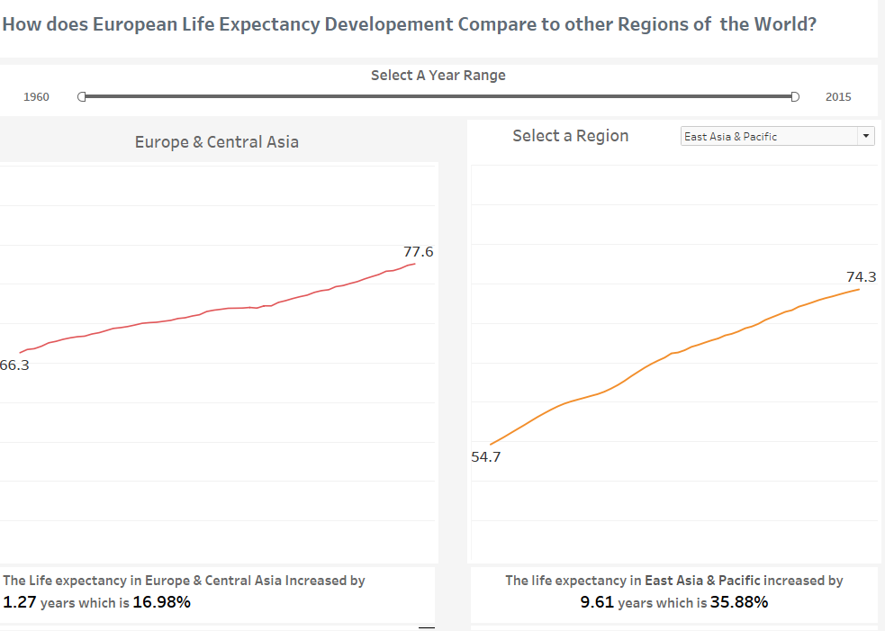
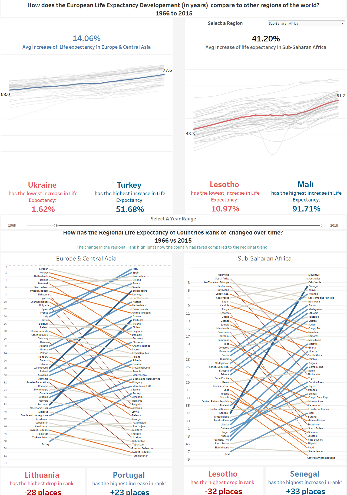
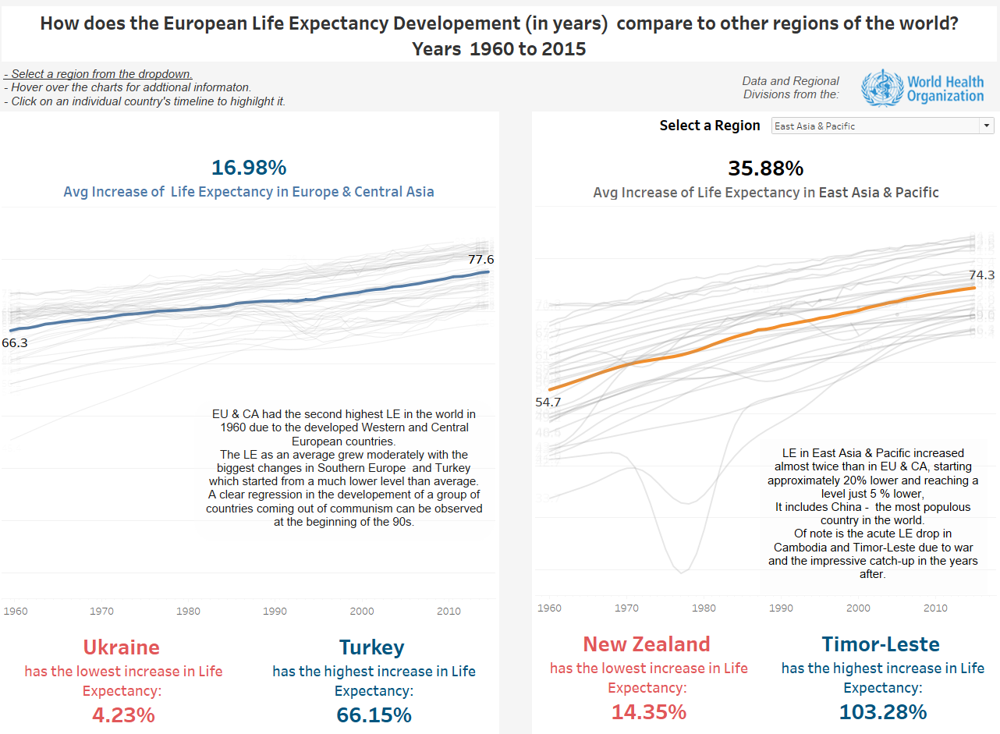

# Create a Tableau Story

## Table of Contents

* [Links](#Links)

* [Summary](#Summary)

* [Design](#Design)  

* [Feedback](#Feedback)

* [Resources](#Resources)

## Links

- [Initial Version](https://public.tableau.com/profile/ioanniskbreier#!/vizhome/who_life_expect_story_ver1/EuropeanStory)  

- [Final Version](https://public.tableau.com/profile/ioanniskbreier#!/vizhome/who_life_expect_story_final/EuropeanStory)

## Summary

In this visualization , I compare the  life expectancy at birth developement in Europe & Central Asia from 1960 to 2015 with other regions in the world.

I use the average life expectancy difference of the region over this time period as the key comparison metric and summarize and highlight the main differences and main observations for each region. Additionally I highlight the countries with the highest and lowest change in their life expectancy.

Most regions (except North America) have had a much higher developement in life expectancy starting from lower levels than Europe and Central Asia. The life expectancy developemnt of regions and individual countries are telling of ther developemnt in general over the last 5 decades.

The data and regional divisions are from the World Health Organization.

## Design

### Version 1

I initially decided to create an interactive visualization where the user could choose the year range and the region to compare the key differences in life expectancy developement between Europe and the other regions.
I wanted to illustrate a visual representaton of the life expectancy change from the start to the end  of the time interval so created two separate tabs with the time series for Europe and the region to compare. I then placed two tabs with the start and end year information below that.

### Version 2

After receiving feedback I realized that I could condense the information and make it more functional. I would also try to clean up the format as much as possible to let the user focus only on the main visualizations findings.

 
### Version 3

After getting feedback thinking more about the plot , I made the following changes:

- Added the indvidual country timelines as a backgorund to the average timeline to give more context and enrich the information.  
- Included a  tab on the top of each with the key finding that I wanted the user to notice
- Include best and worst performing countries on both charts.
- Included the countrie time series in the background.
- Created a slope chart with the change in ranks to illustrate the regional performance of countries.
- Impoved color scheme and line thickness to be more readable.
- Added more explicit titles.

### Version 4 - Final 

After receiving the feedback I made the following changes:

- Removed the slope graph to simplfy the interface and make the visualization more focused.
- Added istructions at the top regarding the interaction. 
- Added a main story as annotation to each line chart  to give emphasis to the key findings and gide the user.
- I omited the choice to change the time interval as it added complexity and made the annotation of the regions  not possible.
- Added start and end annotation to individual countries.
- Increased size of dropdown header to make it more visible.
- Re-added the year-axis, to give more context regarding the time.

I could not do much about the cluttering of the individual country lines without changing the purpose of the visualization which focuses on the average change and the general trend. An additional exploratory/explanatory vizualisation or dropdown choice to explore smaller country groups or interesting events could be added for that purpose.
Additionally answering the 'why' of certain evets is out of the scope of this visualization.

## Feedback

I asked for feedback on all stages of design from 5 different people. Sometimes the questons and answers where verbal and some times thy where written.

These where the main questions (The user could answer any they wanted):

- Do you have any comments about the usability of the visualization
- What do you notice in the visualization?
- What questions do you have about the data?
- What relationships do you notice?
- What do you think is the main takeaway from this visualization?
- Is there something you don’t understand in the graphic?
- What do you think could be improved

### Version 1 

 - The information contained in the chart the could be condensed to a smaller space.
 - There is a lot of information that is repeated in both charts.
 
### Version 2

 - The percentage change is too verbose.
 - I noticed that in general other regions had higher life expectancy developement than Europe.
 - Which countries are included in each region?
 - It would be nice to be able to see individual country timelines.
 
### Version 3

- I noticed the dip in LE in some post-soviet countries. But in general the lines are so close to each other that it is hard to distingish trends. In Europe & Central Asia it would help to add a drop down menu or to cluster countries like DACH, Baltics, BeNeLux, Nordics.  
-  Main question for me is the segmentation of countries like Europe an Central Asia. Most of the Central Asian countries might have more in common with other Asian countries than with European countries. 
- In general it’s visible that LE grows across the different regions and that wars/ethnic conflicts have a significant impact on LE which is visible as a anormal dip in the curve.
-  Actually, the graphics are clear but it is not easy to select single countries in EU and CA and follow their development. 

- What are the rank change colors and sizes?
- Why are some countries decreasing in the second graph?
- I would like to see a more clear and outstandng finding.
- The time axis could be better visible in order to understand faster at one glance in which decade certain developments occurred (e.g. 60s – 70s) which could help to get the bigger picture.
- The second graph is cool but confusing.
- It took me some time to find the dropdown - maybe you should omit it and add all the visualizations in one page.
 
### Version 4 - Final

- Very dense information
- The visualisation describes the trend of life expectancy rate from the year 1960 to 2015. Average increase of this rate are displayed. The trends for Europe & Central Asia can be compared to other regions of the world. Furthermore, along we can see the trends for individual countries by interacting with the viualisation.
- As a data analyst myself, I'm interested in knowing in what shape the data was available. Were there any operations done on it prior to using Tableau to visualise it?
- The life expectancy rate has increased during this period, for most countries. With certain dips that can probably be attributed to catastrophic events. Furthermore, the increase in this rate is larger in 2nd and 3rd world countries, than in europe and/or north america.
- The main takeaway for me is the stark difference between the rate between the developed and developing countries. The developing countries are still lagging behind as of 2015.

## Resources

- http://gamapserver.who.int/gho/interactive_charts/mbd/life_expectancy/atlas.html
